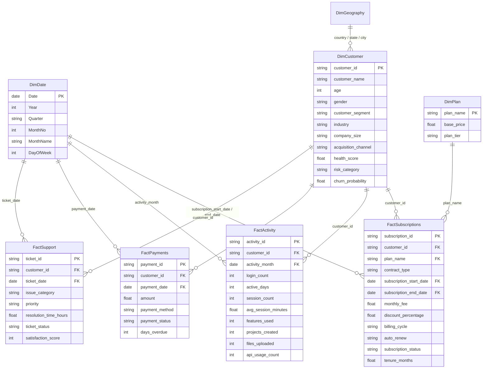

# 🏛️ CloudSync Power BI Star Schema Data Model Architecture

This document describes the enterprise-grade **Star Schema** data architecture designed for the CloudSync Power BI solution. It provides high query performance, clean filter propagation, and eliminates many-to-many ambiguity.

---

## 1. Dimensional Model Overview



---

## 2. Table Catalog & Granularity

| Table Name | Type | Key / Grain | Description |
| :--- | :--- | :--- | :--- |
| **`DimCustomer`** | Dimension (Conformed) | `customer_id` (1 Row per Account) | Firmographic attributes, enriched health scores, RFM quintiles, predicted churn risk |
| **`DimDate`** | Dimension (Role-Playing) | `Date` (1 Row per Calendar Day) | Continuous calendar supporting time-intelligence DAX functions |
| **`DimPlan`** | Dimension | `plan_name` | SaaS tiers (`Basic`, `Professional`, `Business`, `Enterprise`) |
| **`DimGeography`** | Dimension | `GeoKey` (`Country` + `State` + `City`) | Regional hierarchy |
| **`FactSubscriptions`** | Fact (Accumulating Snapshot) | `subscription_id` | Core contract lifecycle, status, MRR, tenure |
| **`FactActivity`** | Fact (Periodic Snapshot) | `activity_id` (Account per Month) | Telemetry engagement (Logins, active days, features, API calls) |
| **`FactPayments`** | Fact (Transactional) | `payment_id` | Invoices, gateway transactions, failed payments, days overdue |
| **`FactSupport`** | Fact (Transactional) | `ticket_id` | Support incidents, resolution velocity, ticket CSAT |

---

## 3. Relationships & Cardinality Settings

- **`DimCustomer[customer_id]` 1 : N `FactSubscriptions[customer_id]`** (Single direction filter: `DimCustomer` -> `FactSubscriptions`)
- **`DimCustomer[customer_id]` 1 : N `FactActivity[customer_id]`** (Single direction filter: `DimCustomer` -> `FactActivity`)
- **`DimCustomer[customer_id]` 1 : N `FactPayments[customer_id]`** (Single direction filter: `DimCustomer` -> `FactPayments`)
- **`DimCustomer[customer_id]` 1 : N `FactSupport[customer_id]`** (Single direction filter: `DimCustomer` -> `FactSupport`)
- **`DimDate[Date]` 1 : N `FactSubscriptions[subscription_start_date]`** (Active)
- **`DimDate[Date]` 1 : N `FactSubscriptions[subscription_end_date]`** (Inactive, activated via `USERELATIONSHIP`)
- **`DimDate[Date]` 1 : N `FactActivity[activity_month]`** (Active)
- **`DimDate[Date]` 1 : N `FactPayments[payment_date]`** (Active)

---

## 4. DAX Calendar Dimension Script

To instantiate the calendar table in Power BI:

```dax
DimDate = 
VAR MinDate = DATE(2022, 1, 1)
VAR MaxDate = DATE(2024, 12, 31)
RETURN
ADDCOLUMNS(
    CALENDAR(MinDate, MaxDate),
    "Year", YEAR([Date]),
    "YearQuarter", YEAR([Date]) & "-Q" & QUARTER([Date]),
    "Quarter", "Q" & QUARTER([Date]),
    "MonthNo", MONTH([Date]),
    "MonthName", FORMAT([Date], "MMMM"),
    "MonthYear", FORMAT([Date], "MMM yyyy"),
    "YearMonthSort", YEAR([Date]) * 100 + MONTH([Date]),
    "DayOfWeekNo", WEEKDAY([Date], 2),
    "DayOfWeek", FORMAT([Date], "dddd")
)
```
